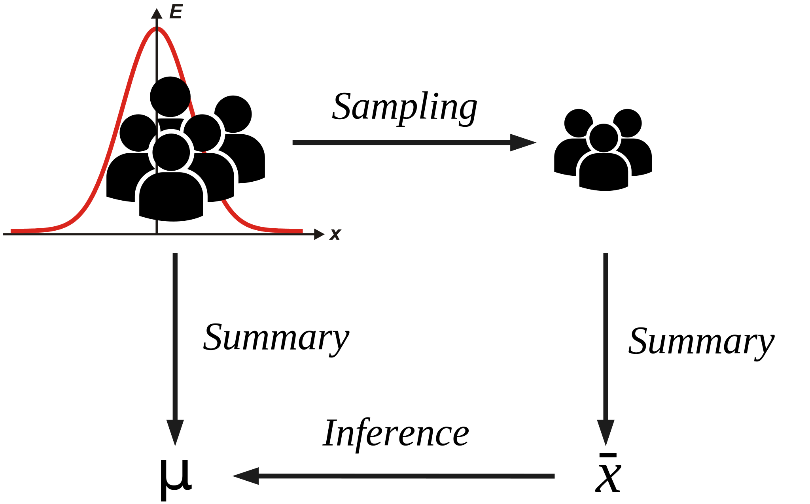
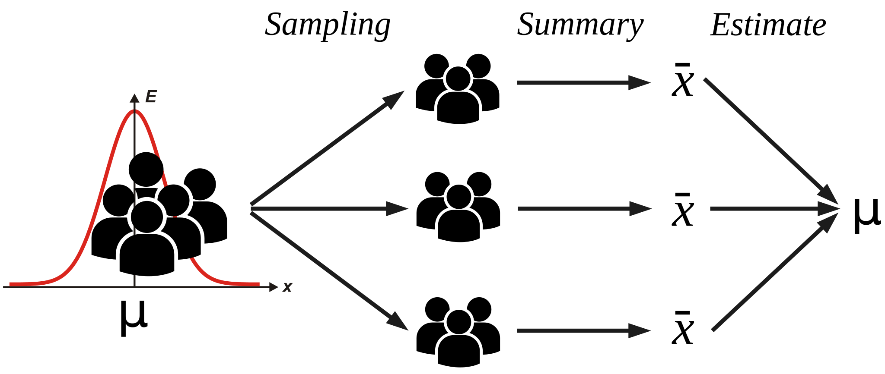
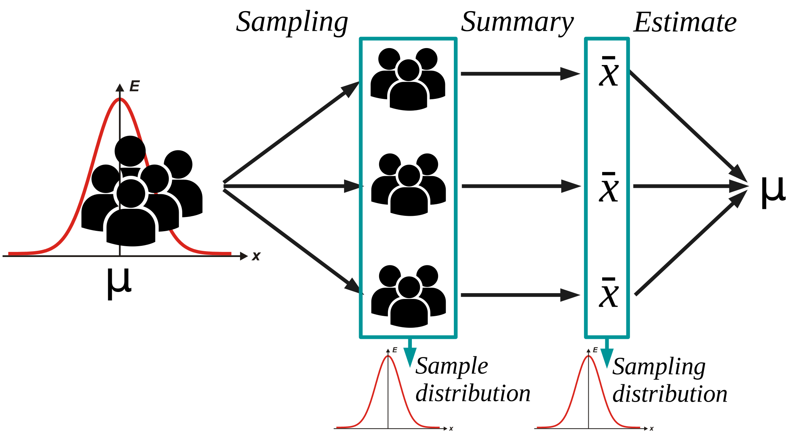

# 統計概論

### 科學的決策框架

<small>2018.02.26</small>

杜岳華

---

## Outline

* 資料觀點
* 機率觀點
* Statistics is about inference and estimation
* Estimation
* 中央極限定理（Central Limit Theorem）
* Hypothesis test
* Maximum Likelihood Estimation

---

## 資料觀點

 

統計是幫我們從**資料**中萃取知識跟資訊的技術

 

假設：藉由蒐集資料可以讓我們了解這個世界

也就是，資料呈現了真實世界的面貌

---

## 依據資料分類

<ul>
<li>Continuous data</li>
  <ul class="fragment">
  <li>Real-valued data</li>
  </ul>
<li>Discrete data</li>
  <ul class="fragment">
  <li>Counting data</li>
  <li>Ordinal data</li>
  <li>Nominal data</li>
    <ul class="fragment">
    <li>Binary data</li>
    <li>Categorical data</li>
    </ul>
  </ul>
</ul>

---

## Real-valued data

> eg. 身高、體重、時間、 
> 空間（長度、體積）

---

## Counting data

> eg. 網站點擊次數 
> 影片瀏覽次數

---

## Ordinal data (次序資料)

> eg. 名次、排序

---

## Nominal data (名目資料)

> eg. 性別、出生年、居住縣市

---

## 沒辦法直接分析的資料

> eg. 文章、陳述性的句子

---

## Noise!

我們從這個世界蒐集到的資料都不那麼*完美*

> eg. 純水的 pH值是7.0，但 pH meter測出來都不會是準確的7.0，一定含有小數點

處理資料都會遇到不確定性（uncertainty）

---

## 我們要如何處理不確定性？

> 我們要怎麼說"純水的 pH值是7.0"

---

## 機率觀點

處理不確定性的絕佳手段是引進機率

把問題轉化為：

> 這件事所發生的機率為何？

---

也就是，在大多數情況下

> 純水的 pH值是接近7.0

但是怎麼知道是7.0，而不是7.001，或是其他數字？

---

## 機率的引進 $P(X = x)$

* 樣本空間 (sample space, $\Omega$): 
在試驗中，所有可能出現的元素的集合

  * 
{1, 2, 3, 4, 5, 6}

* 事件 (event, $x$): 
樣本空間的子集，用簡單的數字來代表

  * 
$x$ = {1}

  * 
$x$ = {1, 2, 3}

* 隨機變數 (random variable, $X$): 
用來代表變項

---

## 事件發生的機率

* $x$ = {1} 
=> $P(X = 1)$

* $x$ = {1, 2, 3} 
=> $P(1 \le X \le 3)$

* $x$ ？ 
=> $P(X = x)$

---

## $P(X = x) = ?$

I don't know.

Maybe take a look at the distribution of data?

Maybe get a hypothesis yourself?

We usually use normal distribution.

(but not always fit, worth give it a try!)

---

---

在資料的分佈中我們會探討兩個趨勢：

<ul>
<li>集中趨勢</li>
  <ul class="fragment">
  <li>mean（平均值）</li>
  <li>median（中位數）</li>
  <li>mode（眾數）</li>
  </ul>
<li>離散趨勢</li>
  <ul class="fragment">
  <li>standard deviation（標準差）</li>
  <li>quartile（四分位數）</li>
  <li>max, min（最大最小值）</li>
  </ul>
</ul>

---

### 在不確定性的世界不要奢望確定性，那不存在

只存在大多數情況及例外

---

### Statistics is about inference and estimation

---

我們假設：

1. 我們的樣本都是從同一個母體來的
2. 樣本之間是互相獨立的

---

## 統計量

我們計算統計量：

* $\bar{x}$
* $s$

希望可以推估母體（機率模型）的參數

* $\mu$
* $\sigma$

---

## Expectation operator (期望值運算子)

$\large P(X = x)$

$\Large \mathbb{E}[X] = \sum_{i=1}^{n} x_i \times P(X = x_i)$

$\Large \mathbb{E}[X] = \int_{-\infty}^{\infty} x_i \times P(X = x_i) dx$

---

## Central Limit Theorem

---

---

---

---

## Central Limit Theorem

Random samples $X_1, X_2, ..., X_n$

from population with mean $\mu$,

if $n \rightarrow \infty$

then $\large \mathbb{E}[X] \rightarrow \mu$

---

## Estimation

* Point estimation
* Interval estimation

---

## Point estimation

我們由資料中得出資料的統計量：

$\LARGE \bar{x} = \frac{\sum_{i=1
}^{n} X_i}{n}$

接著，我們用這個統計量推估（inference）母體的平均值：
 
$\LARGE \mathbb{E}[\bar{x}] = \mu$

*$\bar{x}$ is an unbiased estimation of $\mu$.*

---

## Point estimation

我們由資料中得出資料的統計量：

$\Large s^2$

接著，我們用這個統計量推估（inference）母體的變異數：
 
$\Large \mathbb{E}[s^2] = \frac{(n - 1) \times \sigma^2}{n}$

*$s^2$ is an biased estimation of $\sigma^2$.*

---

## Point estimation

他提供給我們一個值，讓我們知道資料的集中跟離散的程度。

但是這個值有多精準呢？

<blockquote class="fragment">
我們說這組資料的 $\bar{x}$ 會往3.4集中，但...
</blockquote>

<blockquote class="fragment" style="font-size:36px;">
{3.4001, 3.3935, 3.4012, 3.3899, 3.4153} 
{7.033, 2.341, 3.753, 3.097, 1.908, 2.268}
</blockquote>

---

## Interval Estimation

我們利用區間來給出一個估計值

---

## Interval Estimation

通常會用$[\bar{x} - 1.96s, \bar{x} + 1.96s]$區間（信賴區間）

這個區間涵蓋了約95%的機會（信心水準）

---

## Interval Estimation

> 我有95%的信心 $\mu$ 會落在$[\bar{x} - 1.96s, \bar{x} + 1.96s]$ 中

---

## Interval Estimation

> 我有95%的信心 $\mu$ 會落在[3.256, 3.544] 中

---

## Hypothesis test

<ul>
<li>Null hypothesis ($H_0$)</li>
  <ul class="fragment">
  <li>$\bar{x} = \mu_0$</li>
  <li>$\bar{x_1} \le \bar{x_2}$</li>
  </ul>
<li>Alternative hypothesis ($H_1$ or $H_A$)</li>
  <ul class="fragment">
  <li>$\bar{x} \ne \mu_0$</li>
  <li>$\bar{x_1} \gt \bar{x_2}$</li>
  </ul>
</ul>

---

## Z test

$\Large z = \frac{x - \mu_0}{\sigma}$

當 $n \gt 30$，母體是常態分佈時

---

## T test

$\LARGE t = \frac{\bar{x} - \mu_0}{s / \sqrt{n}}$

當 $n \le 30$，母體是常態分佈時

---

## Many other tests

* F test: 檢定variance
* paired t test: 配對型資料
* ANOVA: 檢定三者以上
* Wilcoxon signed-rank test
* Wilcoxon rank-sum test

---

## Probability density function

$P(X = x|\mu, \sigma) = \frac{1}{\sqrt{2\pi}\sigma} exp(-\frac{(x - \mu)^2}{2\sigma^2})$

已知$\mu, \sigma$，求特定$x$的**機率$f(x)$**

---

## Likelihood function

$\mathcal{L}(\mu, \sigma)$

$=f(\mu, \sigma|X_1=x_1, X_2=x_2, ..., X_n=x_n)$

$=f(\mu, \sigma|X_1=x_1) \times f(\mu, \sigma|X_2=x_2) \times ... $
$\times f(\mu, \sigma|X_n=x_n)$

已知資料$X_1=x_1, X_2=x_2, ..., X_n=x_n$，求模型（母體）的**參數$\mu, \sigma$的可能性**

---

## Likelihood function

* $f(\mu, \sigma|X_1=x_1) \times f(\mu, \sigma|X_2=x_2) \times ... $
$\times f(\mu, \sigma|X_n=x_n)$

* $=\prod_{i=1}^{n} f(\mu, \sigma|X_i=x_i)$

* $=\prod_{i=1}^{n} f(\theta|X_i=x_i)$

---

## Maximum likelihood estimation

$arg\,max_{\theta}\ \mathcal{L}(\theta)$ 

or

$arg\,max_{\theta}\ \mathcal{l}(\theta)$

$ = arg\,max_{\theta}\ \log \mathcal{L}(\theta)$

給定機率模型及資料，找到一組參數讓機率模型最符合資料的分佈。

---

## Take home messages

* 資料觀點
* 機率觀點
* Statistics is about inference and estimation
* Estimation
* 中央極限定理（Central Limit Theorem）
* Hypothesis test
* Maximum Likelihood Estimation

---

## Thank you for attention!

### Q & A
