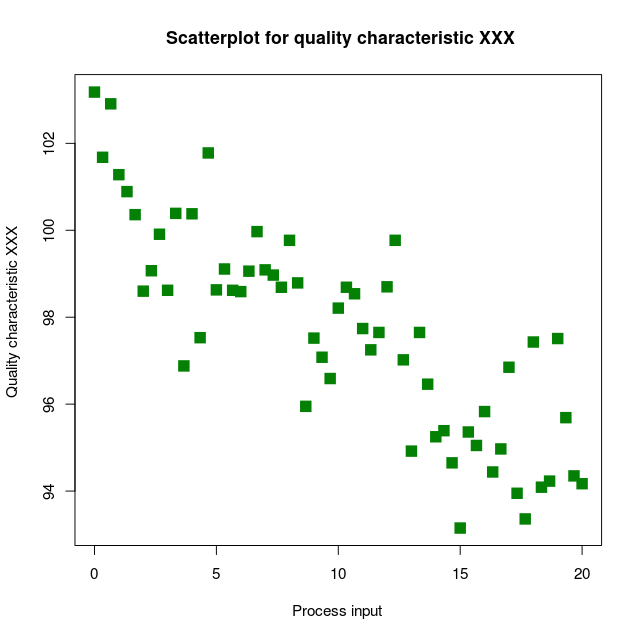
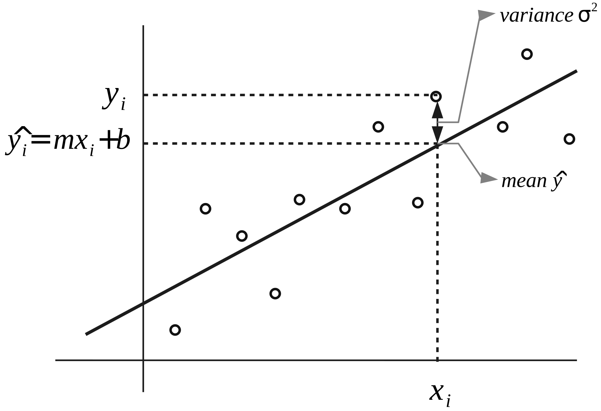
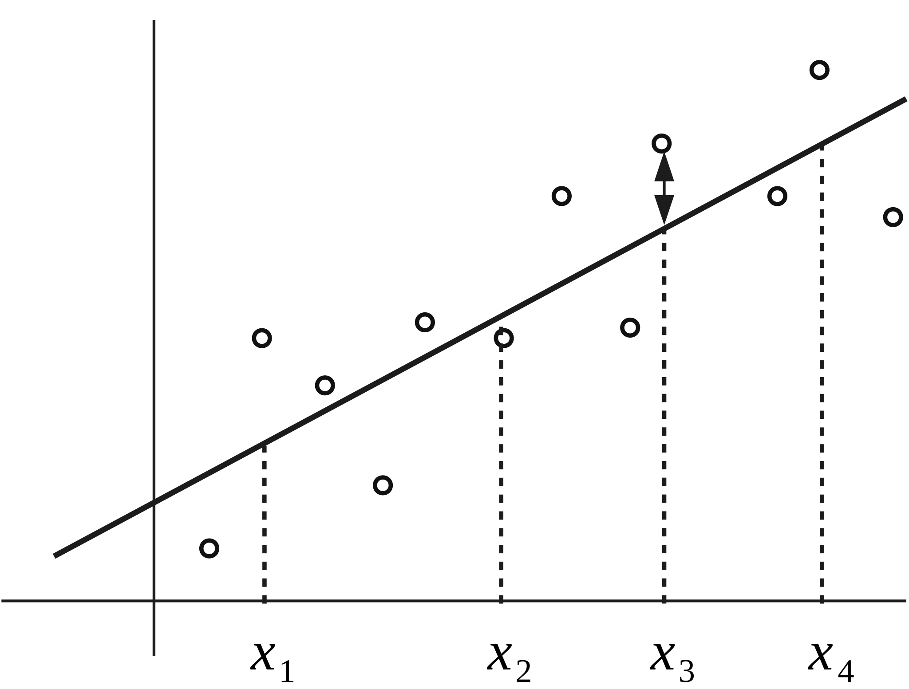
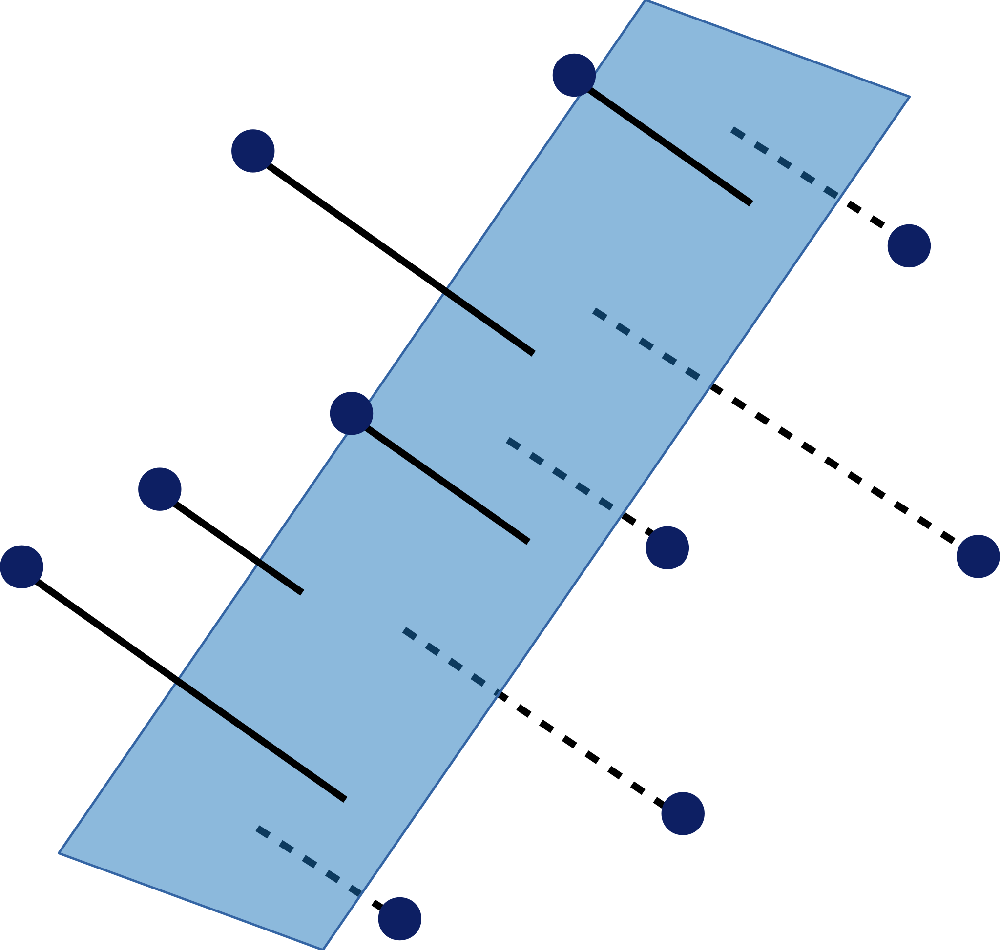
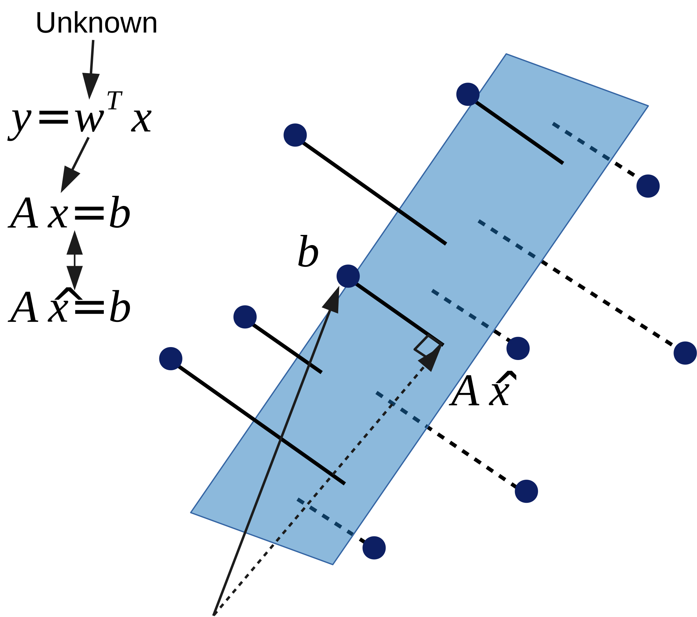
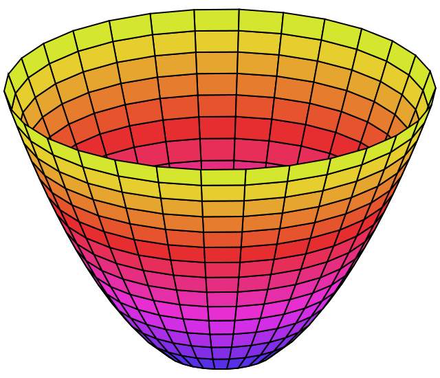

# 線性迴歸

### 進入模型的世界

<small>2018.03.05</small>

杜岳華

---

## Outline

* 資料之間的關係
* Contingency table
* Scatter plot（散佈圖）
* Least square problem and linear regression
* 統計觀點
* 線性代數觀點
* 最佳化觀點
* Multivariate linear regression
* 更多迴歸模型

---

## 統計！然後呢？

我們上次講了統計會關心：

* 集中趨勢
* 離散趨勢

統計想要解的問題不僅止於看資料的趨勢！
<ul>
<li>資料（變數）之間的關係</li>
</ul>

---

## 變數之間的關係

> 問題：我們好奇左撇子跟右撇子的人數，在男生跟女生中有沒有差別？

隨機變數：

* $X$： 慣用手，{左撇子, 右撇子}
* $Y$： 性別，{男生, 女生}

---

## 假設

Independent and identically distributed
* Identically distributed
  * 樣本是從同一個母體來的
* Independent
  * 樣本之間互相獨立

---

## 假設

$X$： 慣用手，{左撇子, 右撇子}

$X\ \overset{iid}{\sim}\ Bernoulli(p_1)$

$Y$： 性別，{男生, 女生}

$Y\ \overset{iid}{\sim}\ Bernoulli(p_2)$

---

## Raw data

| ID | 地址 | 性別 | 慣用手 |
| ------- |
| 001 | ~~ | 男生 | 右撇子 |
| 002 | ~~ | 男生 | 左撇子 |
| 003 | ~~ | 女生 | 右撇子 |
| ... |

---

## Contingency table

| 慣用手\性別 | 男生    | 女生    | Total |
| ------- | ------ | ------- | ----- |
| 右撇子   |     43 |      44 |    87 |
| 左撇子   |      9 |       4 |    13 |
| Total   |     52 |      48 |   100 |

*hypothesis test: $\chi^2\ test$*

---

## Joint probability distribution

After normalized...

| 慣用手\性別 | 男生    | 女生    | Total |
| ------- | ------ | ------- | ----- |
| 右撇子   |   0.43 |    0.44 |   0.87 |
| 左撇子   |   0.09 |    0.04 |   0.13 |
| Total   |   0.52 |    0.48 |   1.00 |

---

## Joint probability distribution

$P(X=x, Y=y)$

<blockquote class="fragment">
quiz 
$P(X={左撇子}, Y={男生}) = ?$
</blockquote>

---

## Marginal probability distribution

| 慣用手\性別 | 男生    | 女生    | Total |
| ------- | ------ | ------- | ----- |
| 右撇子   |   ---- |    ---- |   0.87 |
| 左撇子   |   ---- |    ---- |   0.13 |
| Total   |   0.52 |    0.48 |   1.00 |

---

## Marginal probability distribution

$P(X=x) = \sum_y P(X=x, Y=y)$

$P(Y=y) = \sum_x P(X=x, Y=y)$

---

## Marginal probability distribution

* $P(X=右撇子) = 0.87$
* $P(X=左撇子) = 0.13$
* $P(Y=男生) = 0.52$
* $P(Y=女生) = 0.48$

---

## Raw data

| ID | 地址 | 身高 | 體重 |
| ------- |
| 001 | ~~ | 167 | 65 |
| 002 | ~~ | 187 | 80 |
| 003 | ~~ | 159 | 75 |
| ... |

---

## Scatter plot

---

## 變數之間的關係是什麼？

$y = f(x)$

$Y = f(X)$

我們看看資料！

---

## 線性關係

$Y = f(X) = aX + b$

---

## 材料

* data: {($x_1$, $y_1$), ($x_2$, $y_2$) ...}
* $Y = aX + b$

---

## Least square problem

---

## Least square problem

<ul>
<li>Residuals: $\hat{y} - y$
  <ul>
  <li>$ax_i + b - y_i$</li>
  </ul>
</li>
<li class="fragment">Sum of residuals: $\sum_i (\hat{y} - y_i)$</li>
<li class="fragment">Sum of square: $\sum_i (\hat{y} - y_i)^2$
  <ul>
  <li>$\sum_i (ax_i + b - y_i)^2$</li>
  </ul>
</li>
</ul>

---

## Linear regression

Least square:

$arg\,min_{\theta}\ \sum_i (\hat{y} - y_i)^2$

Linear regression:
 
$arg\,min_{a,b}\ \sum_i (ax_i + b - y_i)^2$

---

## 統計觀點

隱藏假設：Gaussian error

---

## 統計觀點

隱藏假設：Constant variance (homoscedasticity）

---

## 線性代數

$y = ax + b$

$\begin{bmatrix}y_1 \newline y_2 \newline \vdots \newline y_n\end{bmatrix} = a\begin{bmatrix}x_1 \newline x_2 \newline \vdots \newline x_n\end{bmatrix} + b$

---

## 線性代數

$
\begin{bmatrix}
y_1 \newline
y_2 \newline
\vdots \newline
y_n
\end{bmatrix} = a
\begin{bmatrix}
x_1 \newline
x_2 \newline
\vdots \newline
x_n
\end{bmatrix} + b
\begin{bmatrix}1 \newline
1 \newline
\vdots \newline
1
\end{bmatrix}
$

---

## 線性代數

$
\begin{bmatrix}
y_1 \newline
y_2 \newline
\vdots \newline
y_n
\end{bmatrix} = 
\begin{bmatrix}a & b\end{bmatrix}
\begin{bmatrix}
x_1 & 1 \newline
x_2 & 1 \newline
\vdots & \vdots \newline
x_n & 1
\end{bmatrix}$

向量表示： $\mathbf{w} = \begin{bmatrix}a \newline b\end{bmatrix}$, $\mathbf{y} = \mathbf{w}^T \mathbf{x}$

---

## 線性代數觀點

因為資料有noise，點都不在同一平面上，$\mathbf{y} = \mathbf{w}^T \mathbf{x}$沒有解！

那怎麼辦？

---

## 線性代數觀點

那就投影吧！

---

## 線性代數觀點

> 找到一個共同的平面，讓點投影上去，點到面的距離最小

---

## 線性代數觀點

<small>要讓$(b - A\hat{x})$最小，$(b - A\hat{x})$必定垂直平面</small>

<small>$(b - A\hat{x})$垂直平面，$(b - A\hat{x})$跟A的內積為0</small>

---

## 線性代數觀點

$A^T(b - A\hat{x}) = 0$

$A^Tb - A^TA\hat{x} = 0$

$A^TA\hat{x} = A^Tb$

$\hat{x} = (A^TA)^{-1}A^Tb$

---

## 最佳化觀點

$arg\,min_{a,b}\ \sum_i (ax_i + b - y_i)^2$

$f(a, b) = \sum_i (ax_i + b - y_i)^2$

$arg\,min_{a,b}\ f(a, b)$

---

## 最佳化觀點

$f(a, b)$

---

## 最佳化觀點

$f(a, b)$

正確來說應該是長這樣...

---

## 最佳化觀點

要求a, b分別是多少的時候，$f(a, b)$有最小值？

微積分告訴我們，極值存在的地方，他的一階微分是0

也就是

$\frac{\partial f(a, b)}{\partial a} = 0, \frac{\partial f(a, b)}{\partial b} = 0$

---

## 最佳化觀點

$\frac{\partial f(a, b)}{\partial a}$

$= \frac{\partial}{\partial a} \sum_i (ax_i + b - y_i)^2$

$= 2 \sum_i x_i \times (ax_i + b - y_i)$

$= 0$

---

## 最佳化觀點

$\frac{\partial f(a, b)}{\partial b}$

$= \frac{\partial}{\partial b} \sum_i (ax_i + b - y_i)^2$

$= 2 \sum_i 1 \times (ax_i + b - y_i)$

$= 0$

---

## 最佳化觀點

$c_1a + c_2b + c_3 = 0$

$c_1a + c_2b + c_3 = 0$

---

## Multivariate linear regression

$Y = a_0 + a_1X_1 + a_2X_2 + ... + a_nX_n$

---

## 更多迴歸模型

* Ridge regression
* LASSO regression
* Polynomial regression
* Kernel regression
* Isotonic regression
* Robust regression
* Poisson regression

---

Thank you for attention.

Q&A
